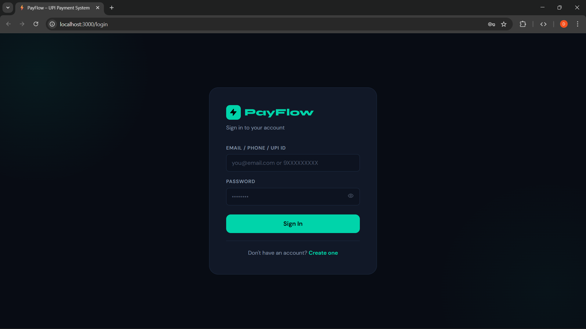
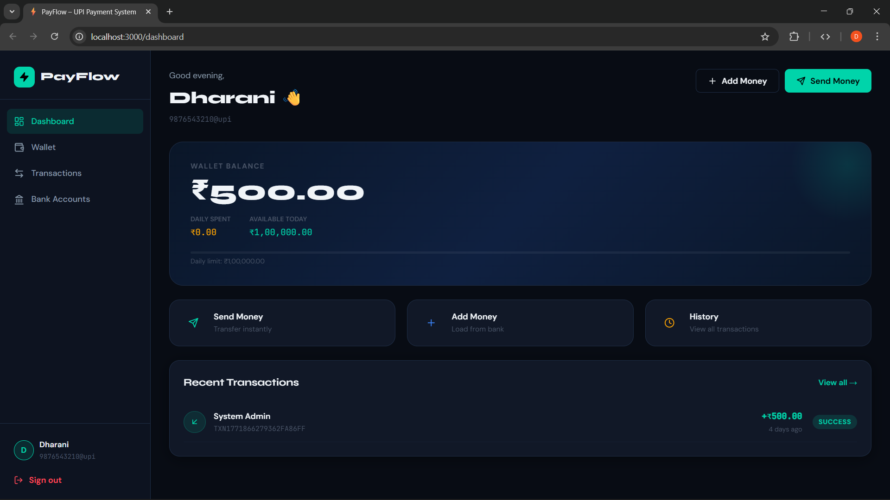
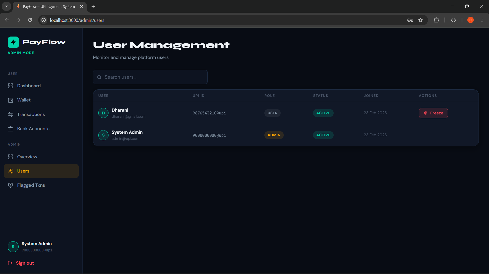

# 💳 UPI Payment Simulation System

A full-stack UPI-like payment platform built with Spring Boot and React.js, inspired by PhonePe and Google Pay.

---

## 📸 Screenshots







---

## ✨ Features

- JWT Authentication with BCrypt password hashing
- Wallet management with real-time balance tracking
- Bank account linking and money deposits
- P2P money transfer with ACID-compliant transactions
- Pessimistic locking to prevent race conditions
- Idempotency protection against duplicate payments
- Fraud detection engine with risk scoring (0–100)
- Admin dashboard with user management and fraud monitoring
- Immutable audit logging
- Swagger API documentation

---

## 🛠️ Tech Stack

| Layer | Technology |
|-------|------------|
| Backend | Spring Boot 3.2, Spring Security, Spring Data JPA |
| Frontend | React.js 18, Axios |
| Database | MySQL 8 |
| Security | JWT, BCrypt |
| API Docs | Swagger / OpenAPI |
| Build | Maven, npm |

---

## ⚙️ Prerequisites

- Java 17+
- Maven 3.8+
- MySQL 8+
- Node.js 18+

---

## 🚀 Getting Started

### 1. Clone the repository
```bash
git clone https://github.com/dharu-dharanic/upi-payment-system.git
cd upi-payment-system
```

### 2. Setup Database
```sql
CREATE DATABASE upi_payment_db;
```

### 3. Run Backend
```bash
cd backend
mvn spring-boot:run
```

> Set these environment variables before running:
> - `DB_USERNAME` = your MySQL username
> - `DB_PASSWORD` = your MySQL password
> - `JWT_SECRET` = any random string (min 32 characters)

Backend runs at: `http://localhost:8080`

### 4. Run Frontend
```bash
cd upi-frontend
npm install
npm start
```

Frontend runs at: `http://localhost:3000`

---

## 📡 API Endpoints

| Method | Endpoint | Description |
|--------|----------|-------------|
| POST | `/api/v1/auth/register` | Register new user |
| POST | `/api/v1/auth/login` | Login |
| GET | `/api/v1/wallet` | Get wallet balance |
| POST | `/api/v1/transactions/transfer` | Send money |
| POST | `/api/v1/transactions/add-money` | Add money from bank |
| GET | `/api/v1/transactions/history` | Transaction history |
| GET | `/api/v1/admin/dashboard` | Admin dashboard |
| GET | `/api/v1/admin/users` | Manage users |

Full API docs: `http://localhost:8080/swagger-ui.html`

---

## 👤 Admin Setup

Register normally at `/register` then run:
```sql
UPDATE users SET role = 'ROLE_ADMIN' WHERE email = 'your@email.com';
```

---

## 📁 Project Structure
```
upi-payment-system/
├── backend/          # Spring Boot REST API
├── upi-frontend/     # React.js frontend
└── screenshots/      # UI screenshots
```